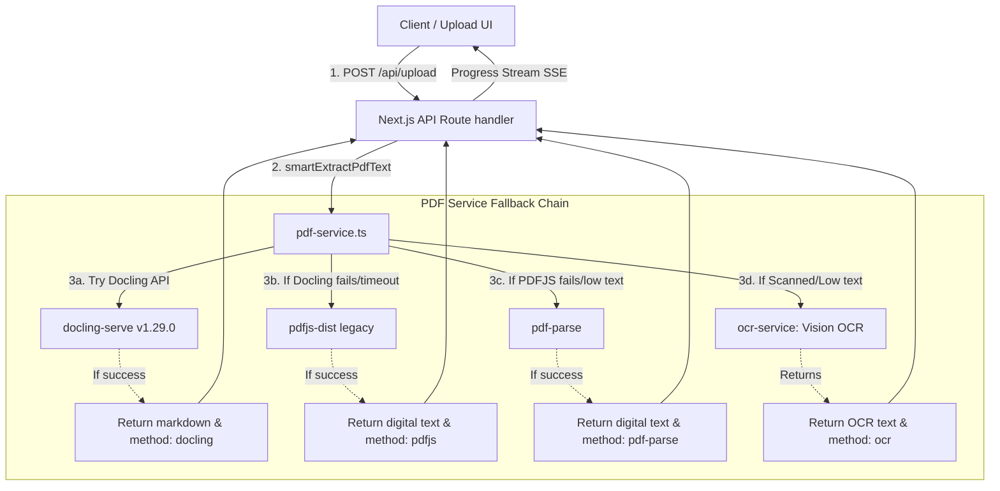

# Phase 2: Core PDF Service Integration - Research

**Researched:** 2026-08-06
**Domain:** Next.js Backend PDF Parsing & Service Integration
**Confidence:** HIGH

<user_constraints>
## User Constraints (from CONTEXT.md)

### Locked Decisions
- **D-01:** Batas waktu (timeout) pemanggilan API Docling dibatasi maksimal 15 detik sebelum memicu proses fallback alternatif.
- **D-02:** Logika fallback akan otomatis dipicu jika terjadi kesalahan jaringan (network error), batas waktu habis (timeout), serta status respons HTTP non-200.
- **D-03:** Pengecekan status kesehatan dari service `docling-serve` dilakukan secara direct call (langsung mengirim request konversi ke `/v1/convert/file` dan menangkap errornya), tanpa melakukan pengecekan endpoint `/health` secara terpisah sebelum memproses upload.
- **D-04:** Detail kesalahan (error) pemanggilan Docling akan dicatat (logged) secara mendalam di server logs (stdout/stderr) untuk keperluan debugging pengembang, sementara transisi fallback ke metode pembacaan digital lainnya berjalan transparan bagi pengguna.
- **D-05:** Menggunakan endpoint HTTP POST `/v1/convert/file` untuk melakukan konversi file PDF secara sinkron (synchronous conversion).
- **D-06:** Mengirimkan parameter `to_formats: ['md']` agar output yang dihasilkan dari Docling hanya berupa Markdown (menghemat payload transfer dan komputasi).
- **D-07:** Konfigurasi OCR pada Docling menggunakan pengaturan bawaan microservice (default), di mana Docling mendeteksi kebutuhan OCR secara otomatis.
- **D-08:** Request multipart/form-data dibangun menggunakan objek global native Node.js 20+ `FormData` dan `fetch` API standar, tanpa dependensi eksternal tambahan.
- **D-09:** Mengirimkan pesan pemrosesan progress ke client-side stream berformat `'Mencoba membaca teks menggunakan Docling...'` di awal proses, dan pesan `'Teks berhasil diekstrak (docling): X karakter'` saat proses ekstraksi berhasil.
- **D-10:** Menambahkan nilai `'docling'` pada type signature method ekstraksi (`method: 'pdfjs' | 'pdf-parse' | 'ocr' | 'docling'`) yang dikembalikan oleh function `smartExtractPdfText`.
- **D-11:** Ketika fallback terjadi, pesan transisi yang informatif (seperti `'Metode Docling gagal/timeout. Beralih ke pembacaan digital alternatif...'`) akan dikirimkan ke client-side progress stream.
- **D-12:** Jika API `docling-serve` mengembalikan status non-200 (misalnya 422 validation error), server logs akan mencatat body respons error JSON secara lengkap sebelum melanjutkan proses fallback.

### the agent's Discretion
Semua area dikonfigurasi sesuai preferensi dan persetujuan eksplisit dari pengguna. Tidak ada area keputusan yang didelegasikan ke diskresi agen.

### Deferred Ideas (OUT OF SCOPE)
None — discussion stayed within phase scope.
</user_constraints>

<architectural_responsibility_map>
## Architectural Responsibility Map

| Capability | Primary Tier | Secondary Tier | Rationale |
|------------|-------------|----------------|-----------|
| PDF Conversion Request | Frontend Server | — | Next.js API route handler uses the backend `pdf-service.ts` helper to construct a native Node `fetch` call containing the PDF buffer. |
| Fallback & Timeout | Frontend Server | — | The wrapper logic catches all fetch network errors, non-200 HTTP statuses, or aborts from a 15-second `AbortSignal` timeout, seamlessly continuing the extraction chain. |
| Progress SSE Streaming | Frontend Server | Browser/Client | The route handler captures extraction steps and relays messages via Server-Sent Events stream to updating client components. |
</architectural_responsibility_map>

<research_summary>
## Summary

This research focuses on integrating the IBM Docling PDF document parsing microservice (`docling-serve`) into the Next.js/TypeScript backend of the PUU Tracker application. IBM Docling is a state-of-the-art layout-aware document parser that identifies columns, reads structured tables, and preserves document hierarchy by producing clean Markdown.

The standard integration pattern involves building a `multipart/form-data` request with native Node.js `FormData` and sending it to the `/v1/convert/file` synchronous endpoint. Fallback strategies must handle HTTP failures, connection issues, or processing timeouts (capped at 15s) using `AbortController` in JS fetch. If Docling fails, the service falls back to `pdfjs` -> `pdf-parse` -> `ocr-service` in that order.

**Primary recommendation:** Use standard `fetch` with native `AbortSignal.timeout(15000)` and native `FormData` holding the PDF content as a `Blob` named `files` and a JSON string parameter `options={"to_formats":["md"]}`. Catch all errors, log detailed context, send descriptive streaming progress messages, and trigger the existing fallback chain.
</research_summary>

<standard_stack>
## Standard Stack

### Core
| Library / Service | Version | Purpose | Why Standard |
|-------------------|---------|---------|--------------|
| docling-serve | v1.29.0 | Layout-aware PDF conversion server | Runs containerized CPU-based parser producing layout-safe Markdown |
| Native fetch | Node 20+ | Direct HTTP service call | Native, lightweight, supports AbortController, avoids package bloat |
| Native FormData | Node 20+ | Multi-part form construction | Native standard for sending files and text options in Node.js 20+ |

### Supporting
| Library | Version | Purpose | When to Use |
|---------|---------|---------|-------------|
| pdfjs-dist | ^4.8.30 | Primary digital text extraction fallback | First fallback stage for quick text retrieval from digital PDFs |
| pdf-parse | ^1.1.1 | Secondary digital text extraction fallback | Second fallback stage if pdfjs-dist fails to parse the document |

### Alternatives Considered
| Instead of | Could Use | Tradeoff |
|------------|-----------|----------|
| Native Node fetch | Axios / node-fetch | Fetch is built-in for Node 18/20+, avoiding extra dependencies and bundle size. |
| docling-python-sdk | Direct HTTP API calls | Python SDK would require running python commands or spawning child processes from Next.js, which is complex and memory-intensive compared to a lightweight containerized REST API. |

**Installation:**
No new npm packages are needed as we are using native Node 20+ `fetch` and `FormData`.
</standard_stack>

<architecture_patterns>
## Architecture Patterns

### System Architecture Diagram



### Recommended Project Structure
No structural changes are needed; we will update the existing backend files:
```
src/
├── lib/
│   └── pdf-service.ts       # Integrate Docling adapter + fallback chain
└── app/
    └── api/
        └── upload/
            └── route.ts     # Update progress logging and response tags
```

### Pattern 1: Native Node Fetch with Form-Data and Abort Signal
**What:** Using standard `FormData` and `fetch` with `AbortSignal.timeout(15000)` to submit the conversion payload to `docling-serve`.
**When to use:** In any backend controller calling the Docling API.
**Example:**
```typescript
async function fetchDoclingText(pdfBuffer: Buffer): Promise<string> {
    const baseUrl = process.env.DOCLING_API_URL || 'http://localhost:5001';
    const endpoint = `${baseUrl.replace(/\/$/, '')}/v1/convert/file`;

    // Construct request
    const formData = new FormData();
    const blob = new Blob([pdfBuffer], { type: 'application/pdf' });
    formData.append('files', blob, 'document.pdf');
    formData.append('options', JSON.stringify({ to_formats: ['md'] }));

    const response = await fetch(endpoint, {
        method: 'POST',
        body: formData,
        signal: AbortSignal.timeout(15000), // 15s timeout (D-01)
    });

    if (!response.ok) {
        const errorText = await response.text();
        throw new Error(`Docling API Error: ${response.status} - ${errorText}`);
    }

    const data = await response.json() as {
        status: string;
        document?: {
            md_content?: string;
        };
    };

    if (data.status !== 'success' || !data.document?.md_content) {
        throw new Error(`Docling conversion not fully successful: ${JSON.stringify(data)}`);
    }

    return data.document.md_content;
}
```

### Pattern 2: Integrating Fallback and Client-Side Progress Update Callbacks
**What:** Integrating Docling into the existing `smartExtractPdfText` pipeline and executing callbacks dynamically.
**When to use:** In `smartExtractPdfText` implementation.

### Anti-Patterns to Avoid
- **Pre-checking `/health` via extra HTTP fetch:** Doing a `/health` check before every upload adds an extra HTTP roundtrip. Catching errors directly on `/v1/convert/file` is faster and handles transient downtime during the conversion itself.
- **Hand-rolling custom form boundary generator:** Let standard Node `FormData` handle the boundary string formatting automatically. Specifying custom header boundaries manually often causes 400 Bad Request or malformed body parsing on Python-based REST servers like `docling-serve`.
- **Catching only timeout errors:** Fallbacks should trigger on Network Errors (connection refused, DNS failure), status code failures (502, 500, 422), as well as timeouts.
</architecture_patterns>

<dont_hand_roll>
## Don't Hand-Roll

| Problem | Don't Build | Use Instead | Why |
|---------|-------------|-------------|-----|
| Multipart body serialization | Custom string boundary builders | Native `FormData` class | Formatting boundaries manually is error-prone, especially with binary buffers. |
| Timeout cancellation | Custom `setTimeout` wrappers with manual promises | `AbortSignal.timeout(ms)` | Standard native API, clean error propagation, doesn't leak memory timers. |
| PDF parsing engine | Hand-rolled layout engine | IBM Docling (via service) | Docling handles complex structures (multi-column legal text, nested tables) using state-of-the-art layout models that are extremely complex to replicate. |
</dont_hand_roll>

<common_pitfalls>
## Common Pitfalls

### Pitfall 1: Incorrect Multipart Form Key for docling-serve
**What goes wrong:** The server returns `422 Unprocessable Entity` or `Missing File Parameter`.
**Why it happens:** The Python FastAPI backend of `docling-serve` expects files under the parameter key `files` (plural). Using `file` (singular) causes a schema validation error.
**How to avoid:** Always use `formData.append('files', ...)` to match the expected schema.
**Warning signs:** Server logs output `422` with a detailed schema error message: `[{"loc":["body","files"],"msg":"field required"}]`.

### Pitfall 2: Stream Socket Hanging after Timeout
**What goes wrong:** Next.js backend exhausts active socket connections or leaks memory under load.
**Why it happens:** When a fetch is aborted due to a timeout, if not handled correctly, the socket might remain open until the connection keeps alive.
**How to avoid:** Ensure the response or stream is correctly disposed of or let standard Node global agent garbage collect aborted fetch requests. Use `AbortSignal.timeout` which cleans up its own event listeners.

### Pitfall 3: Failing with Missing Filename in FormData Blob
**What goes wrong:** The python-multipart parser in Docling throws a boundary parse error.
**Why it happens:** When passing a `Blob` in `FormData` in Node.js, if a filename is not explicitly specified in `append('files', blob, 'filename.pdf')`, Node may supply an empty filename or fail to format the field header correctly.
**How to avoid:** Always provide a placeholder filename as the third argument to `FormData.append()`.
</common_pitfalls>

<code_examples>
## Code Examples

### Full Integration of Docling into smartExtractPdfText
```typescript
import { cleanPdfText } from './utils';

// Update types
export async function smartExtractPdfText(
    pdfBuffer: Buffer,
    onProgress?: (msg: string) => void
): Promise<{
    text: string;
    method: 'pdfjs' | 'pdf-parse' | 'ocr' | 'docling';
    numPages?: number;
}> {
    // Method 1: Try Docling API first (Phase 2 integration)
    try {
        if (onProgress) onProgress('Mencoba membaca teks menggunakan Docling...');
        
        const baseUrl = process.env.DOCLING_API_URL || 'http://localhost:5001';
        const endpoint = `${baseUrl.replace(/\/$/, '')}/v1/convert/file`;
        
        const formData = new FormData();
        const blob = new Blob([pdfBuffer], { type: 'application/pdf' });
        formData.append('files', blob, 'document.pdf');
        formData.append('options', JSON.stringify({ to_formats: ['md'] }));

        const response = await fetch(endpoint, {
            method: 'POST',
            body: formData,
            signal: AbortSignal.timeout(15000), // D-01: 15s timeout
        });

        if (!response.ok) {
            const errorText = await response.text();
            throw new Error(`HTTP Error ${response.status}: ${errorText}`);
        }

        const data = await response.json() as {
            status: string;
            document?: {
                md_content?: string;
            };
        };

        if (data.status === 'success' && data.document?.md_content) {
            const extractedText = data.document.md_content;
            if (onProgress) {
                onProgress(`Teks berhasil diekstrak (docling): ${extractedText.length} karakter`);
            }
            return {
                text: cleanPdfText(extractedText),
                method: 'docling'
            };
        } else {
            throw new Error(`Docling conversion status: ${data.status}`);
        }

    } catch (e) {
        // D-04: Log detailed error in server console
        console.error('Docling extraction failed, initiating fallback:', e);
        
        // D-11: Notify client about the fallback
        if (onProgress) {
            onProgress('Metode Docling gagal/timeout. Beralih ke pembacaan digital alternatif...');
        }
    }

    // Method 2: Try pdfjs-dist
    try {
        if (onProgress) onProgress('Mencoba membaca teks digital...');
        const result = await extractTextFromPdf(pdfBuffer);
        if (result.text.length > 200 && !result.isScanned) {
            return {
                text: cleanPdfText(result.text),
                method: 'pdfjs',
                numPages: result.numPages
            };
        }
        console.log('pdfjs got little text, trying pdf-parse...');
    } catch (e) {
        console.error('pdfjs failed:', e);
    }

    // Method 3: Try pdf-parse
    try {
        if (onProgress) onProgress('Metode 1 gagal/timeout, mencoba metode alternatif...');
        const pdfParse = require('pdf-parse');
        const data = await pdfParse(pdfBuffer);
        if (data.text && data.text.length > 200) {
            return {
                text: cleanPdfText(data.text),
                method: 'pdf-parse',
                numPages: data.numpages
            };
        }
        console.log('pdf-parse also got little text');
    } catch (e) {
        console.error('pdf-parse failed:', e);
    }

    // Method 4: Vision OCR
    console.log('Trying Vision OCR for scanned PDF...');
    if (onProgress) onProgress('PDF terdeteksi sebagai scan/gambar. Beralih ke Vision OCR (ini mungkin memakan waktu)...');

    const { extractTextWithVision } = await import('./ocr-service');
    const ocrText = await extractTextWithVision(pdfBuffer, onProgress);

    return {
        text: cleanPdfText(ocrText),
        method: 'ocr'
    };
}
```
</code_examples>

<sota_updates>
## State of the Art (2024-2025)

| Old Approach | Current Approach | When Changed | Impact |
|--------------|------------------|--------------|--------|
| pdfjs-dist / pdf-parse | Layout-aware Neural Parsers (Docling/Marker) | 2024-2025 | Preserves structured elements (headers, sub-sections, nested bullet points) and markdown tables. |
| Tesseract OCR | Layout-aware vision models (VLM/PaddleOCR) | 2024 | Much higher recognition rates on tabular/scanned documents. |

**New tools/patterns to consider:**
- **Synchronous vs Asynchronous conversion:** For files smaller than 10-15MB, synchronous `/v1/convert/file` is faster. For massive files, asynchronous processing `/v1/convert/file/async` + polling prevents gateway timeouts, but is out of scope for Phase 2.
- **Node fetch + FormData:** Supports native streaming and file wrappers.

**Deprecated/outdated:**
- **`request` npm package:** Outdated and insecure. Use native `fetch`.
- **`form-data` npm package:** Outdated. Native `FormData` works perfectly in Node 20+.
</sota_updates>

<open_questions>
## Open Questions

1. **How does Docling handle massive PDF files under CPU constraint in the synchronous endpoint?**
   - What we know: Large files will take longer to parse on CPU, potentially exceeding the 15-second timeout limit.
   - What's unclear: The exact performance curve of `docling-serve-cpu` container on typical legal PDFs (50+ pages).
   - Recommendation: Since the timeout is strictly locked to 15s (D-01), any large document that takes longer than 15s will naturally fallback to `pdfjs` or `ocr-service`. This protects system responsiveness.

2. **Are there document validation limits inside docling-serve?**
   - What we know: Malformed PDFs might trigger 422 or 500 errors.
   - What's unclear: Response schemas for varied document corruption.
   - Recommendation: Catching all non-200 statuses and parsing the error JSON body completely (D-12) will ensure we record the validation issue in server logs while fallback runs seamlessly.
</open_questions>

<validation_architecture>
## Validation Architecture

To achieve full test coverage and guarantee the robustness of the fallback system (Nyquist compliance), the validation strategy will cover the following:

1. **Unit/Integration Tests for `smartExtractPdfText`:**
   - **Mocking Docling API Success:** Intercept the fetch call to `docling-serve` and return mock Markdown content to verify Docling is successfully selected.
   - **Mocking Docling API Failure:** Intercept the fetch call to return `500 Internal Server Error`, network error, or invalid JSON, verifying that the system successfully falls back to the digital extraction chain (`pdfjs` -> `pdf-parse`).
   - **Mocking Timeout:** Simulate a slow request (>15s) and verify that the `AbortSignal` terminates the fetch and triggers the fallback digital path.

2. **Integration Tests for API Route Progress Logging:**
   - Verify that the SSE controller emits the exact Indonesian progress messages:
     - At initiation: `'Mencoba membaca teks menggunakan Docling...'`
     - On successful Docling parsing: `'Teks berhasil diekstrak (docling): X karakter'`
     - On fallback transition: `'Metode Docling gagal/timeout. Beralih ke pembacaan digital alternatif...'`

3. **Verification Commands:**
   - Quick run: `npx vitest run src/lib/pdf-service.test.ts`
   - Full suite run: `npm run test`
</validation_architecture>

<sources>
## Sources

### Primary (HIGH confidence)
- IBM Docling Documentation: https://ds4sd.github.io/docling/
- Docling Serve GitHub Repository: https://github.com/DS4SD/docling-serve
- MDN fetch API: https://developer.mozilla.org/en-US/docs/Web/API/Fetch_API
- Node.js FormData documentation

### Secondary (MEDIUM confidence)
- Docker Compose specs for docling-serve-cpu container.
</sources>

<metadata>
## Metadata

**Research scope:**
- Core technology: IBM Docling, docling-serve v1.29.0
- Ecosystem: Next.js backend, Node.js 20 runtime, Docker
- Patterns: HTTP multipart/form-data requests, async AbortController timeout, stream progress callbacks
- Pitfalls: Timeout limits, service failures, form data keys

**Confidence breakdown:**
- Standard stack: HIGH - docling-serve is the designated service, native fetch is modern standard.
- Architecture: HIGH - straightforward fallback chain wrapper around `smartExtractPdfText`.
- Pitfalls: HIGH - FastAPI standard error formats and multipart keys are well-documented.
- Code examples: HIGH - code fits the existing pattern exactly.

**Research date:** 2026-08-06
**Valid until:** 2026-09-06 (30 days - stable microservice API)
</metadata>

---

*Phase: 02-core-pdf-service-integration*
*Research completed: 2026-08-06*
*Ready for planning: yes*
