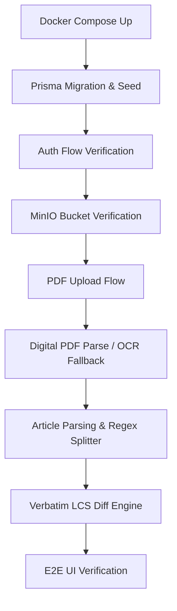

# Phase 6: Core Feature Verification - Research

**Researched:** 2026-06-13
**Domain:** End-to-End Core Feature Verification and Environment Auditing
**Confidence:** HIGH

<user_constraints>
## User Constraints (from CONTEXT.md)

No user constraints - all decisions at the agent's discretion.
</user_constraints>

<architectural_responsibility_map>
## Architectural Responsibility Map

Map each capability to its architectural owner:

| Capability | Primary Tier | Secondary Tier | Rationale |
|------------|-------------|----------------|-----------|
| Environment & Docker Build | DevOps / Infrastructure | — | Runs build, lint, and runtime services in Docker containers. |
| Database & Seeding | Database/Storage | Backend | Prisma schema sync, migrations, and password hashing for seeded users. |
| Object Storage (MinIO) | Database/Storage | Backend | PDF upload streaming, bucket verification, and proxy access URL generation. |
| PDF Extraction & OCR | Backend | AI Service (Gemini/Vision) | Runs local digital parsing or falls back to parallel Vision OCR API calls. |
| Article Parsing | Backend | AI Service (OpenAI/Gemini) | Processes text into JSON arrays of articles with Regex fallback. |
| LCS Diff Engine | Backend / Library | Browser/Client | Calculates LCS differences at word level and renders inline comparison. |
| NextAuth & Guards | Backend Server | Frontend Router | Enforces authentication and role-based route/actions authorization. |
</architectural_responsibility_map>

<research_summary>
## Summary

This phase plans the comprehensive audit and validation of the PUU Tracker application's core functionality. The system depends on several critical services (PostgreSQL, MinIO, OpenAI/Vision proxies) and custom libraries (Verbatim LCS diff engine, concurrent Promise pooled OCR chunking, Regex article parsing). 

Our research verifies that the application setup includes robust Docker Compose configurations, Vitest unit testing, standard Next.js App Router, Prisma ORM, and MinIO SDK client libraries. To verify the system behaves correctly, we will execute both automated testing and targeted manual checks of all API routes, page views, file flows, and error boundaries.

**Primary recommendation:** Build and spin up the Docker Compose environment, verify seed credentials, check MinIO bucket access, trigger text extraction & OCR, execute LCS diff engine unit tests, and perform a complete E2E upload-to-compare cycle.
</research_summary>

<standard_stack>
## Standard Stack

The established libraries/tools for this domain:

### Core
| Library | Version | Purpose | Why Standard |
|---------|---------|---------|--------------|
| Vitest | 4.1.8 | Unit testing runner | Standard Next.js/React 19 testing library |
| Prisma | 7.3.0 | Database ORM | Database schema management & migrations |
| MinIO Client | 8.0.6 | Object Storage SDK | Interacts with local/cloud MinIO storage |
| NextAuth | 5.0.0-beta.30 | Authentication | Route and session protection |

### Supporting
| Library | Version | Purpose | When to Use |
|---------|---------|---------|-------------|
| bcryptjs | 3.0.3 | Password Hashing | Checking user seeding logic |
| pdfjs-dist | 4.0.379 | PDF parsing | Digital text extraction |
| openai | 6.17.0 | LLM client | AI-assisted article parsing |
</standard_stack>

<architecture_patterns>
## Architecture Patterns

### System Verification Flow



### Verification Scripts
To verify the DB connection, we can use the prisma schema client directly:
```bash
npx prisma db pull
npx prisma status
```
To run unit tests:
```bash
npm run test:run
```
</architecture_patterns>

<dont_hand_roll>
## Don't Hand-Roll

| Problem | Don't Build | Use Instead | Why |
|---------|-------------|-------------|-----|
| Verification scripts | Custom bash ping loops | Prisma CLI / MinIO MC / curl | Standard tools provide detailed diagnostic codes |
| Authentication checks | Hardcoded cookies/tokens | NextAuth standard callbacks | Prevents session hijacking and bypass |
| Diff Comparison | Custom string matchers | diff-engine.ts | Edge cases in punctuation and spacing |
</dont_hand_roll>

<common_pitfalls>
## Common Pitfalls

### Pitfall 1: Port Collisions
- **What goes wrong:** Port 5432 or 9000 already bound.
- **Why it happens:** Other postgres or minio instances running on host.
- **How to avoid:** Map host ports to 5434 (postgres), 9002/9003 (MinIO Console) as in `docker-compose.yml`.

### Pitfall 2: Stale MinIO Buckets
- **What goes wrong:** Uploads fail with "Bucket does not exist".
- **Why it happens:** MinIO container recreated without persistent volume or `createbuckets` container failed to complete.
- **How to avoid:** Run `docker compose ps` to check `createbuckets` exit status.

### Pitfall 3: Vision API Key Invalidity
- **What goes wrong:** OCR fails on scanned PDFs.
- **Why it happens:** Stale Google Vision API key or expired proxy key.
- **How to avoid:** Test proxy endpoint using curl before running tests.
</common_pitfalls>

<sources>
## Sources

### Primary (HIGH confidence)
- `docker-compose.yml` - container configurations
- `package.json` - npm dependencies
- `src/lib/ocr-service.test.ts` & `src/lib/diff-engine.test.ts` - existing unit tests
</sources>

<metadata>
## Metadata

**Research scope:**
- Core technology: Next.js, Postgres, MinIO, Vitest
- Ecosystem: Docker, NextAuth, Prisma
- Patterns: E2E Verification Flow
- Pitfalls: Port conflicts, stale buckets, Vision API keys

**Confidence breakdown:**
- Standard stack: HIGH
- Architecture: HIGH
- Pitfalls: HIGH

**Research date:** 2026-06-13
**Valid until:** 2026-07-13
</metadata>

---

*Phase: 06-core-feature-verification*
*Research completed: 2026-06-13*
*Ready for planning: yes*
