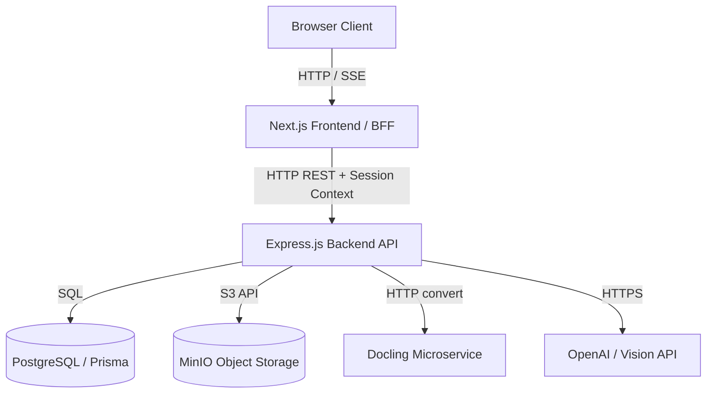

<!-- generated-by: gsd-doc-writer -->
# Architecture

## System Overview

PUU Tracker is a web application designed to track, parse, and analyze Indonesian legal regulations (Peraturan Perundang-Undangan - PUU). The system is built using a decoupled monorepo architecture where the Next.js frontend acts as a Backend-For-Frontend (BFF) proxy, and the Express.js backend serves as a stateless REST API hosting all database operations (Prisma/PostgreSQL), file storage (MinIO), and machine learning pipelines (Docling PDF layout parser and OpenAI GPT completions).

## Component Diagram

## Data Flow

### PDF Document Upload & Processing Sequence
1. **Initiation:** The user uploads a PDF regulation version on the upload form (`frontend/src/app/upload/page.tsx`).
2. **Proxy Redirection:** The browser posts a `multipart/form-data` request containing the PDF stream to the Next.js API handler (`frontend/src/app/api/upload/route.ts`).
3. **Session Header Injection:** The BFF proxy verifies the user's active session, injects authenticated details as headers (`X-User-Id` and `X-User-Role`), and forwards/pipes the multipart stream to the Express backend endpoint (`POST /api/upload`).
4. **Storage Stream:** The backend router (`backend/src/routes/upload.ts`) processes the stream using Multer middleware and calls the PDF service (`backend/src/lib/pdf-service.ts`) to stream the file buffer directly to MinIO.
5. **Layout Extraction:** The PDF service requests layout conversion from the CPU-only `docling-serve` container. If the conversion fails or Docling is offline, it automatically falls back sequentially to `pdfjs` and vision OCR parsing.
6. **Clause Structuring:** The raw Markdown text produced by the extraction chain is sent to the AI service (`backend/src/lib/ai-service.ts`) where OpenAI GPT parses clauses (pasal) and validates structure using regex heuristics.
7. **Persistence:** The parsed articles are stored atomically in the PostgreSQL database via Prisma client, and the frontend BFF forwards progress updates to the browser using Server-Sent Events (SSE).

### State Management
- **User Sessions:** Managed statelessly on the frontend BFF via encrypted JWT credentials cookies (`next-auth`).
- **Authorization Context:** Session contexts (`X-User-Id` and `X-User-Role`) are propagated dynamically via request headers to keep the Express API stateless.
- **Relational Data:** Managed in PostgreSQL.
- **Binary Assets:** Managed in MinIO storage buckets.

## Key Abstractions

- **BFF fetch helper (`frontend/src/lib/api.ts`):** Centralized HTTP request utility (`fetchFromBackend`) that targets the backend REST host and handles JWT context forwarding.
- **Authentication check middleware (`backend/src/middleware/auth.ts`):** Stateless routing middleware that inspects headers for active user roles and rejects unauthorized administrative writes.
- **PDF parser client (`backend/src/lib/pdf-service.ts`):** Adapts Docling conversion endpoints and coordinates the automatic fallback parsing pipeline.
- **Database Client (`backend/src/lib/prisma.ts`):** Shares a single database pool connection pool via a Prisma client singleton.

## Directory Structure Rationale

- **`frontend/`** — Next.js web workspace. Isolates UI rendering and user-facing BFF routing, running on port `3006`.
- **`backend/`** — Express.js server workspace. Contains all REST routers, business service controllers, and database access utilities, running on port `3007`.
- **`backend/prisma/`** — Centralizes the database schemas, seed configurations, and migrations to avoid monorepo type conflicts.
- **`scripts/`** — Shared smoke flow testing scripts used to verify E2E integration locally and in CI.

---

*Architecture analysis: 2026-08-07*
