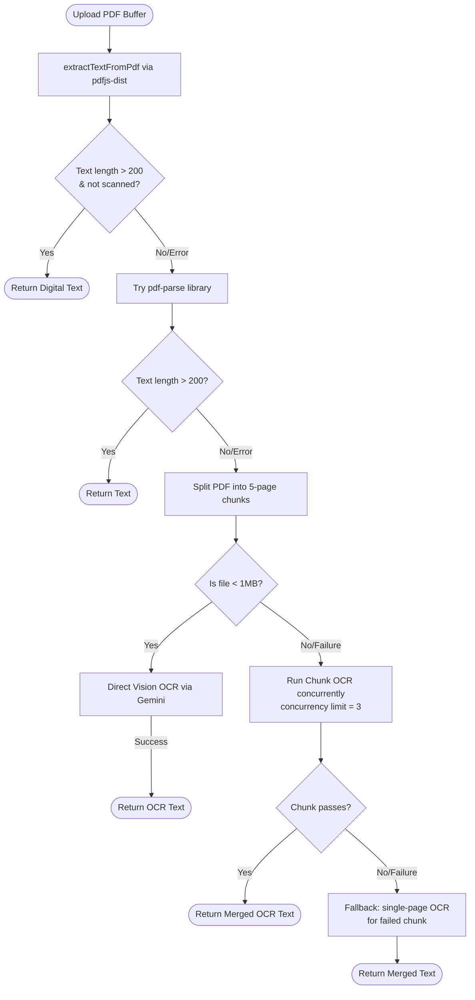

# PUU Tracker System Architecture

This document describes the technical architecture and data flow of the **PUU Tracker** application, focusing on its core mechanisms: the text extraction pipeline and the verbatim comparison (diff) engine.

---

## 1. System Components & High-Level Design

PUU Tracker is designed around a decoupled, service-oriented architecture:

```
┌─────────────────────────────────────────────────────────────────┐
│                          Web Interface                          │
│                   Next.js Pages & Components                    │
└────────────────────────────────┬────────────────────────────────┘
                                 │ Server Actions
                                 ▼
┌─────────────────────────────────────────────────────────────────┐
│                          Service Layer                          │
│     pdf-service.ts     ocr-service.ts     ai-service.ts         │
└───────┬────────────────────────┬────────────────────────┬───────┘
        │                        │                        │
        ▼ S3 API                 ▼ OpenAI API             ▼ Prisma
┌───────────────┐        ┌───────────────┐        ┌───────────────┐
│ MinIO Storage │        │   LLM Proxy   │        │  PostgreSQL   │
│ (Raw PDFs)    │        │ (Vision/Chat) │        │ (Metadata/DB) │
└───────────────┘        └───────────────┘        └───────────────┘
```

* **Client Component Views**: Interactive, responsive dashboards and compare blocks using Framer Motion and Lucide icons.
* **Server Actions**: Directly perform operations (e.g. creating regulation records, running comparisons) and talk to database/storage.
* **Service Libraries**: Handle low-level integration (OCR, PDF splitting, LCS diff calculation).

---

## 2. Text Extraction & Fallback Pipeline

Legislation PDFs can be digitally generated (selectable text) or scanned images. The system implements a robust, multi-stage pipeline in `src/lib/pdf-service.ts` and `src/lib/ocr-service.ts` to ensure text is extracted under all circumstances.



### Fallback Details
1. **pdfjs-dist**: Attempts to parse character tokens and maps coordinates. If total characters extracted are `< 100 * totalPages`, it flags the PDF as scanned.
2. **pdf-parse**: Serves as a fallback for old digital PDFs that cause coordinate exceptions in PDF.js.
3. **Smart PDF Chunking**: Large PDFs exceed API payload constraints (usually 4MB or 15MB). The system uses `pdf-lib` to extract and compile 5-page PDF sub-documents.
4. **Resilient Vision OCR**: Chunks are processed via `/chat/completions` using the `gemini-2.5-flash` model. If a chunk fails, the service falls back to extracting pages one by one for that chunk.
5. **Concurrent Pool (`runWithConcurrencyLimit`)**: Runs tasks with a configurable concurrency limit (default: 3) to prevent HTTP 429 (Rate Limit) errors from the LLM endpoint.

---

## 3. Verbatim LCS Diff Engine

The diff engine (`src/lib/diff-engine.ts`) implements a word-level (verbatim) Longest Common Subsequence (LCS) algorithm to track legislative modifications.

### Step 1: Tokenization (`tokenize`)
Instead of lines or characters, text is tokenized into words and whitespace/punctuation.
```typescript
// Example: "Pasal 1: Negara Indonesia..."
// Tokens: ["Pasal", " ", "1", ":", " ", "Negara", " ", "Indonesia"]
```
This preserves whitespaces and punctuation so that formatting differences are displayed accurately without breaking word alignments.

### Step 2: LCS Matrix Calculation (`longestCommonSubsequence`)
Calculates the longest common subsequence of tokens between the old token array ($A$) and new token array ($B$) using Dynamic Programming (DP) with space optimization:
$$\text{dp}[i][j] = \begin{cases} 
\text{dp}[i-1][j-1] + 1 & \text{if } A[i-1] == B[j-1] \\ 
\max(\text{dp}[i-1][j], \text{dp}[i][j-1]) & \text{otherwise} 
\end{cases}$$

### Step 3: Backtracking & Diff Generation (`compareTexts`)
Backtracks through the DP table from $(m, n)$ to $(0, 0)$ to reconstruct the LCS sequence. During this traversal:
* Tokens present in both arrays are marked as `equal`.
* Tokens present only in the old array are marked as `delete`.
* Tokens present only in the new array are marked as `insert`.

### Step 4: Adjacency Merging (`mergeParts`)
Adjacent diff segments with the same type are merged to reduce DOM rendering load:
```
[Delete: "Pasal"], [Delete: " "], [Delete: "1"] 
                 ▼ Merged
[Delete: "Pasal 1"]
```

---

## 4. LLM-Assisted Article Parser

Once text is extracted, the raw text is unstructured. `src/lib/ai-service.ts` converts the text into a structured JSON database schema.
1. **LLM Prompting**: It uses the LLM proxy to extract articles and map them into a JSON list containing:
   * `articleNumber` (e.g. *Pasal 1*, *Pasal 2 ayat (1)*)
   * `content` (verbatim text)
2. **Regex Fallback**: If the LLM output is malformed (fails to parse as JSON), the system falls back to a regex-based parser. The regex scans for word patterns like `^Pasal \d+` or `^BAB [IVXLCDM]+` to partition the text, ensuring that the upload pipeline is never blocked.
