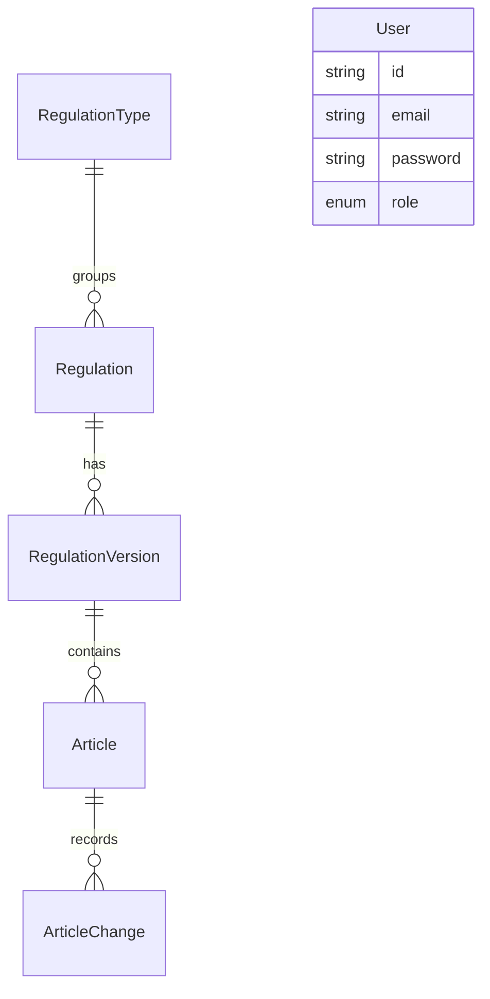

# PUU Tracker Developer Guide

This guide is designed for developers who want to understand, build, and extend the **PUU Tracker** codebase. It describes the application architecture, directory structure, data models, and instructions for extending system capabilities.

---

## 1. Codebase Layout

PUU Tracker is built using **Next.js (App Router)**, **React 19**, and **TypeScript**. Code is organized cleanly under the `src` directory:

```
puu/
├── prisma/                   # Prisma database schemas and migrations
│   └── schema.prisma         # Primary PostgreSQL database schema
├── public/                   # Static assets (images, fonts, etc.)
├── docs/                     # Project markdown documentation
├── src/
│   ├── actions/              # Next.js Server Actions (data mutations)
│   ├── app/                  # Next.js pages, layouts, and API routes
│   │   ├── api/              # API route handlers (e.g. file upload, download proxy)
│   │   ├── dashboard/        # Main dashboard screen
│   │   ├── compare/          # Version comparison UI
│   │   └── manage/           # Admin console for user management
│   ├── components/           # Reusable React UI components
│   │   └── ui/               # shadcn UI primitives (Button, Input, etc.)
│   ├── lib/                  # Core services, utilities, and helper libraries
│   │   ├── ai-service.ts     # LLM-assisted article parsing & splitting
│   │   ├── diff-engine.ts    # LCS-based word comparison engine
│   │   ├── ocr-service.ts    # Vision OCR for scanned pages
│   │   ├── pdf-service.ts    # PDF text extraction & page splitting
│   │   └── storage.ts        # MinIO object storage wrapper
│   └── proxy.ts              # Local proxy configuration (if applicable)
├── tsconfig.json             # TypeScript config (defines @/* path aliases)
└── package.json              # Script registration and dependencies
```

---

## 2. Key Technology Integrations

### Next.js App Router & React 19
The project leverages Next.js App Router for hybrid routing (Server vs Client components) and NextAuth for secure credential verification.

### Prisma ORM & PostgreSQL
All metadata, parsed legal articles, and diff summaries are persisted in a PostgreSQL database using Prisma ORM.
* Schema file: `prisma/schema.prisma`
* Shared client: import from `@/lib/prisma` (instantiated in `src/lib/prisma.ts`).

### MinIO Object Storage
MinIO is used for local PDF file storage, providing an S3-compatible API.
* File Upload API: `/api/upload` streams incoming PDF uploads directly to MinIO.
* Helper client: `src/lib/storage.ts` provides file uploading and presigned URL generation.

### LLM & Vision OCR Service
The app integrates with an LLM provider (configured via proxy in `.env`) to handle:
* **Vision OCR**: Concurrently running scanned PDF pages through Gemini Vision OCR (`src/lib/ocr-service.ts`).
* **Text Structuring**: Parsing raw Indonesian legal text into structured JSON articles (`src/lib/ai-service.ts`).

### Automatic Regulation Fetcher & Pasal.id API Fallback
The automatic fetching service (`src/lib/regulation-fetcher.ts`) queries public repositories to import new legislation versions automatically:
* **Endpoint route**: `src/app/api/regulations/fetch/route.ts` manages query parsing, NextAuth authorization checks, and streams raw text extraction progress to client UIs.
* **Fallback API client**: Integrates with the external Pasal.id API to serve as a high-reliability fallback when public JDIH crawlers fail or become rate-limited.
* **Configuration variable**: Set `PASAL_ID_TOKEN` in `.env` to enable authenticating to the Pasal.id search and detail endpoints. If left unconfigured, Strategy 4 fallback will be skipped.

---

## 3. Database Model Architecture

The PostgreSQL schema is structured around legislation hierarchy:



### Key Models
1. **RegulationType**: Holds the classification of the regulation (e.g. `UU`, `PP`, `Perpres`).
2. **Regulation**: Grouping model for a specific topic (e.g. "Jaminan Kesehatan").
3. **RegulationVersion**: Represents a specific enactment (e.g. *Perpres No. 82 Tahun 2018*). References a parent `Regulation` and contains a self-relation (`amendsId` -> `RegulationVersion.id`) to track its parent version.
4. **Article**: Individual pasal in a regulation version (e.g. "Pasal 1"). Stores raw text content.
5. **ArticleChange**: Holds the calculated difference (LCS diff) between this article and its older version, including change type (`ADDED`, `MODIFIED`, `DELETED`), and AI-generated notes summarizing the change.

---

## 4. Extending the Application

### Running a Dev Server
Follow these steps to run the application locally:
1. Ensure Docker Desktop is running.
2. Spin up postgres and minio services:
   ```bash
   docker compose up -d
   ```
3. Generate the Prisma client and apply migrations:
   ```bash
   npx prisma generate
   npx prisma db push
   ```
4. Run the development server (runs on port `3006`):
   ```bash
   npm run dev
   ```

### Adding a New Component
* Create UI-focused components in `src/components/`. If importing a component into an App Router page, use the `'use client'` directive at the top only when the component utilizes browser hooks (e.g. `useState`, `framer-motion`, `useEffect`).
* Standard shadcn primitives can be added using npx: `npx shadcn@latest add <component-name>`.

### Modifying Server Actions
* Server actions are defined in `src/actions/` and must start with the `'use server';` directive.
* Actions should always return a structured result conforming to:
  ```typescript
  export interface ActionResult<T> {
      success: boolean;
      data?: T;
      error?: string;
  }
  ```
  Wrap database operations in `try/catch` and log error contexts using `console.error`.
